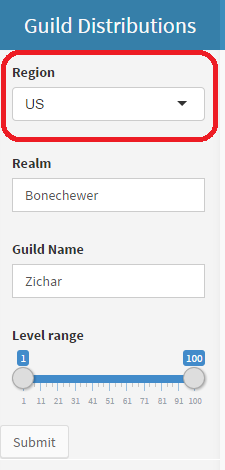
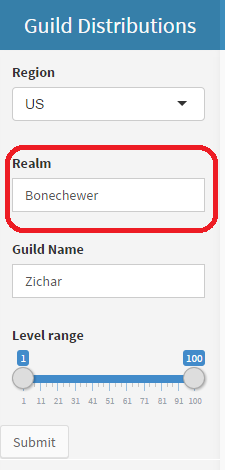
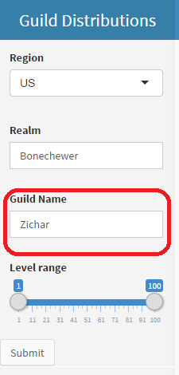
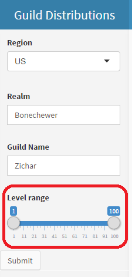
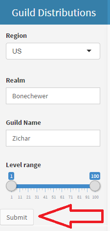

## Usage Guide

1. Select the region where the guild is playing
2. Specify the realm where the guild is playing in
3. Specify the guild name
4. Select the level range of players to display
5. Click the "Submit" button
<div style='text-align: center;'>
    
    
    
    
    
</div>

---

## Data Source

* Takes data from WoW servers using the
<a href='http://blizzard.github.io/api-wow-docs/'>WoW API</a>

```{r}
library(RCurl)
getURLContent('http://us.battle.net/api/wow/guild/Bonechewer/Zichar?fields=members')
```

---

## Implementation

* Shiny code
  * https://github.com/ejjarder/guild.distributions
* Slidify Presentation
  * https://github.com/ejjarder/ejjarder.github.io/tree/master/guild.distributions

## Thank you!
<div style='text-align: center;'>
Pearrenswee - Zichar - Bonechewer - US
</div>
