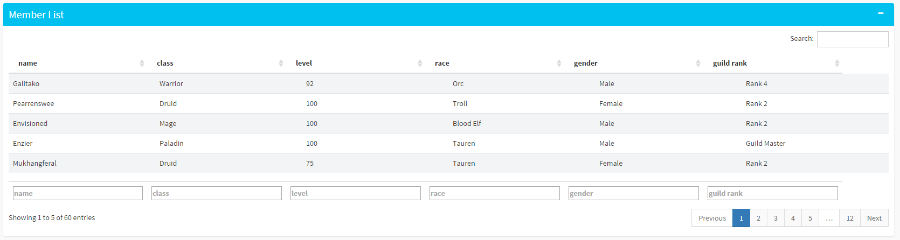
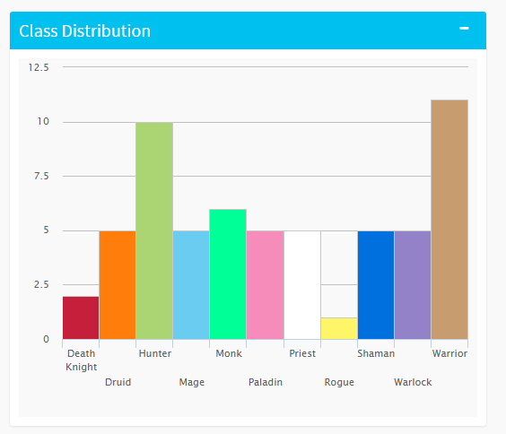

--- .class #id 

## WoW Guild Distributions

* An app to visualize the class, race, and gender distributions in a guild.
* Takes data from WoW servers using the
<a href='http://blizzard.github.io/api-wow-docs/'>WoW API</a>

    

---

## Usage Guide

Select the region where the guild is playing

    

---

## Usage Guide

Specify the realm where the guild is playing in

    

---

## Usage Guide

Specify the guild name

    

---

## Usage Guide

Select the level range of players to display

    

---

## Usage Guide

Click the "Submit" button

    

---

## Guild Overview

The guild level and achievement points are shown on the top of the page

    

---

## Member List

* User can sort by the name, class, race, gender, and guild rank

    

---

## Class Distribution

* Mouse over to see the count per class

    

---

## Race Distribution

* Mouse over to see the count per race

    

---

## Gender Distribution

* Mouse over to see the count per gender

    

---

## git repositories

* Shiny code

https://github.com/ejjarder/guild.distributions

* Slidify Presentation:
  
https://github.com/ejjarder/ejjarder.github.io/tree/master/guild.distributions

---

## Thank you!

    

Pearrenswee - Zichar - Bonechewer - US

